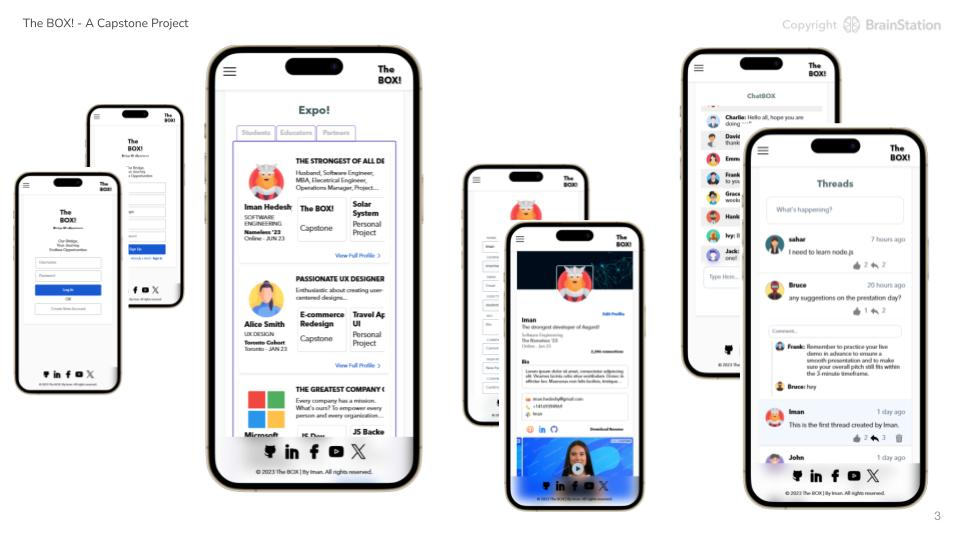

# BrainStation BOX Client

  

## Overview

Welcome to the BrainStation BOX client application! This is the front-end of our comprehensive yearbook and social networking platform.

  
  <a href="https://github.com/imanhedeshy/the-box-server.git"> TheBOX! API Repository</a>

## Features

- ✨ Sign in, sign up, and sign out functionality
- 📷 Profile page to showcase your abilities and experiences
- 📚 Yearbook page to connect with your cohort
- 🌐 Social networking features like posting, commenting, and liking
- 💬 Real-time chat to stay connected with peers
- 🚀 Top students can contribute to app growth
- 🎉 Fun group activities and more!

## Tech Stack

- 🚀 React for dynamic UI components
- 🌐 Axios for handling API requests
- 🔒 JWT for authentication and authorization
- 🌈 Sass for styling with BEM methodology
- 📚 React Router for navigation
- 💬 Socket.io for real-time chat

## Installation

1. Clone the repository.
2. Navigate to the project folder: `cd brainstation-box-client`.
3. Install dependencies: `npm install`.
4. Run the development server: `npm start`.

## How to Use

1. Sign up or log in to access the features.
2. Navigate through the different pages using the navigation bar.
3. Showcase your skills, connect with peers, and contribute to discussions.
4. Participate in real-time chats and enjoy the fun activities!
